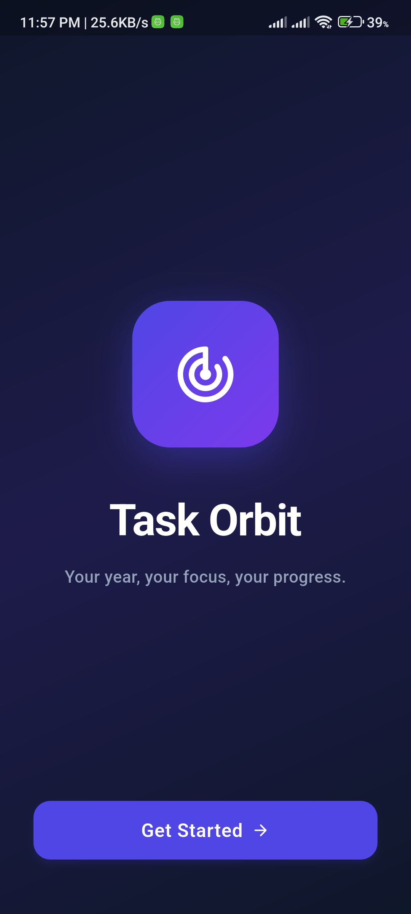
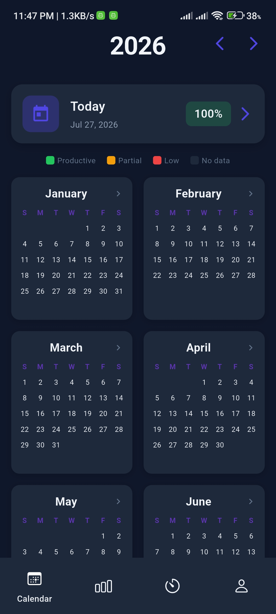
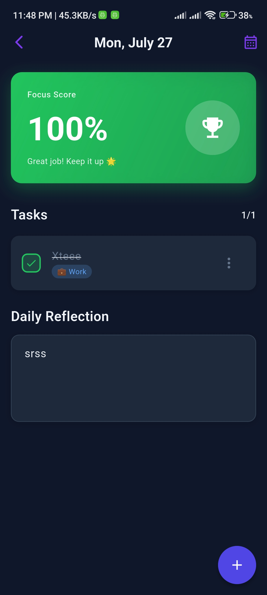
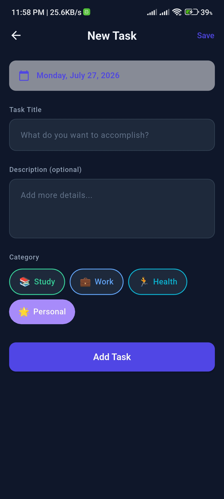
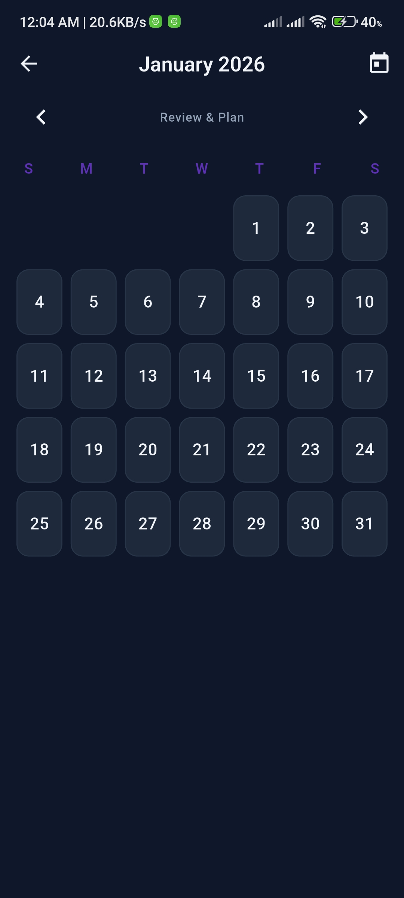
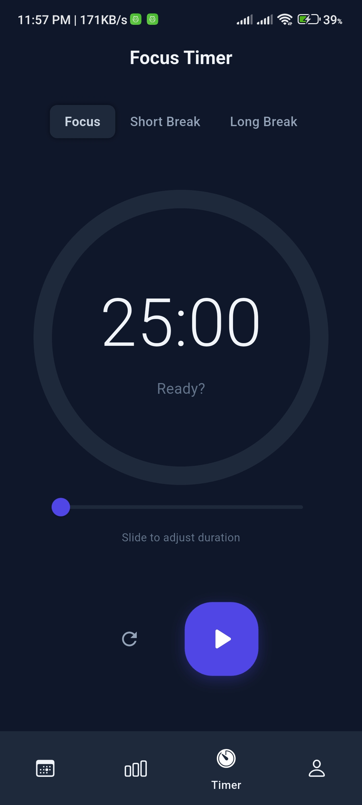
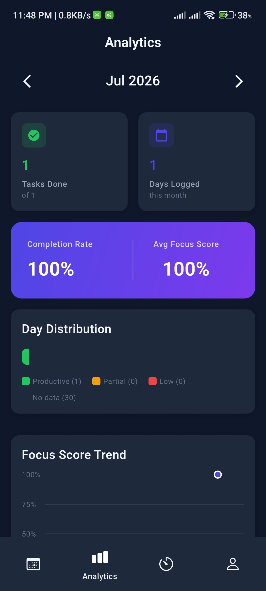
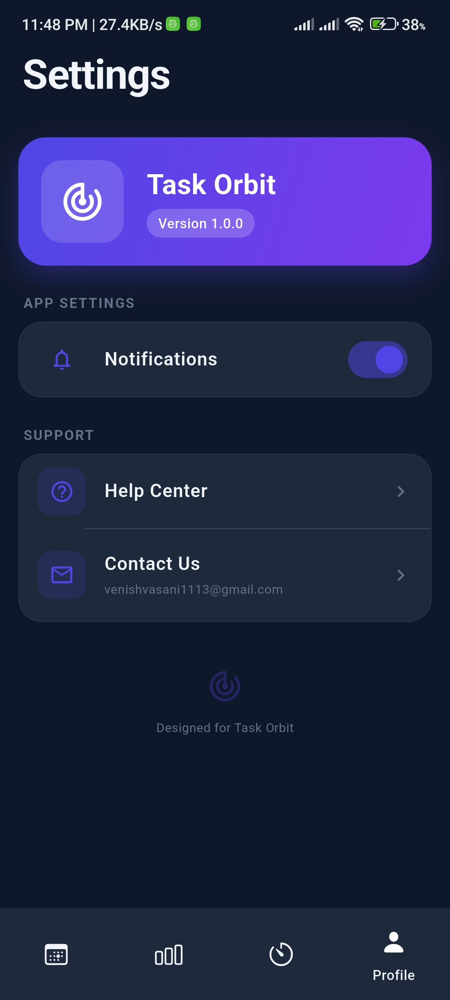

# 🚀 Task Orbit — Smart Task & Productivity Tracker

<p align="center">
  
</p>

<p align="center">
  <em>Your year, your focus, your progress.</em>
</p>

<p align="center">
  
  
  
  
  
  
</p>

---

A sleek, high-performance cross-platform **productivity and task management** mobile application built using **Flutter**, **Provider Pattern**, and **Clean Architecture**. **Task Orbit** empowers users to organize daily tasks across categories, track focus scores with a yearly heatmap calendar, analyze monthly productivity trends, and maintain deep work sessions with a built-in Pomodoro timer — all fully offline with local SQLite storage.

> **⚠️ Note on Source Code & NDA:**  
> The core repository and source code are **private** due to client non-disclosure agreements (NDA). This repository serves as a **technical showcase** featuring the app's architecture, UI/UX design, feature overview, and evaluation demos.

---

## 📱 App Screenshots & Visual Walkthrough

| Splash | Home | Today's Tasks | Create Task |
| :---: | :---: | :---: | :---: |
|  |  |  |  |

| Calendar | Focus Timer | Analytics | Settings |
| :---: | :---: | :---: | :---: |
|  |  |  |  |

---

## 🚀 Key Features & Functionalities

### 1. 📅 Yearly Calendar Heatmap
- **365-Day Productivity Overview:** A GitHub-style contribution heatmap displaying daily productivity scores across the entire year at a glance.
- **Color-Coded Days:** Each day is tinted based on task completion rates — 🟢 Productive (≥70%), 🟡 Partial (40–69%), 🔴 Low (<40%), and ⬜ No Data.
- **Year Navigation:** Seamlessly browse through past and future years with intuitive forward/back controls.
- **Today Quick Access Card:** One-tap navigation to today's daily log with live focus score preview.

### 2. 📝 Advanced Task Management
- **Smart Task Creation:** Swiftly create, update, and organize tasks with detailed descriptions and categorized tagging.
- **Category System:** Four built-in categories — 📚 Study, 💼 Work, 🏃 Health, 🌟 Personal — each with distinct color coding and emoji identifiers.
- **Status Tracking:** Multi-state task lifecycle — ⏳ Pending → ✅ Done, ❌ Not Done, or ⏸️ Skipped — with one-tap toggle or detailed menu selection.
- **Swipe-to-Delete:** Intuitive Dismissible gestures for quick task removal with visual feedback.

### 3. 🎯 Daily Focus Score & Reflections
- **Dynamic Focus Score Card:** A prominent gradient card displaying the day's focus percentage with adaptive color theming and motivational messages.
- **Productivity Icons:** Context-aware icons — 🏆 Trophy (≥70%), 📈 Trending Up (40–69%), ➡️ Flat (<40%), 📝 Add Task (0%).
- **Daily Reflection Journal:** A dedicated text area for end-of-day reflections with auto-save (debounced 2s) for journaling habits.

### 4. 📊 Monthly Analytics & Insights
- **Completion Reports:** Dynamic charts powered by `fl_chart` tracking monthly productivity streaks and completed task ratios.
- **Category Breakdown:** Visual insights into task distribution across Study, Work, Health, and Personal categories.
- **Focus Score Trends:** Line graphs showing focus score progression over the month with percentage indicators.
- **Day Distribution Bar:** Stacked horizontal bar showing productive vs. partial vs. low-productivity day counts.

### 5. ⏱️ Pomodoro Focus Timer
- **Customizable Focus Sessions:** Adjustable timer duration from 25 to 120 minutes via an elegant slider control.
- **Three Modes:** Focus, Short Break, and Long Break with distinct visual modes and smooth circular progress animation.
- **Minimal Controls:** Clean play/pause and reset buttons with premium rounded UI and shadow depth effects.
- **Live Progress Ring:** A 300px circular progress indicator with rounded stroke caps for satisfying visual feedback.

### 6. ⚙️ Settings & Profile
- **Premium Settings UI:** Gradient app info card, grouped settings sections with earthy color palette.
- **Notification Toggle:** Enable/disable reminder notifications for focus sessions.
- **Help & Support:** Quick access to help center and one-tap email copy to clipboard.
- **Version Display:** Clearly displayed app version badge within the branded header card.

---

## 🛠️ Technical Architecture & Tech Stack

### Technology Stack

| Layer | Technology | Purpose |
|---|---|---|
| **Framework** | Flutter 3.10+ (Dart) | Cross-platform UI |
| **Architecture** | Clean Architecture | Separation of concerns — Presentation, Data layers |
| **State Management** | Provider / ChangeNotifier | Predictable and reactive state handling |
| **Local Storage** | SQLite (`sqflite`) | Offline-first CRUD with indexed queries |
| **Charts & Viz** | `fl_chart` | Interactive analytics and trend visualization |
| **UI Animations** | `flutter_staggered_animations` | Smooth list and grid entry animations |
| **Date Handling** | `intl` | Locale-aware date formatting |

### Project Structure

```
lib/
├── main.dart                          # App entry point & Provider setup
├── core/
│   ├── constants/
│   │   ├── colors.dart                # Earthy color palette & productivity helpers
│   │   ├── dimensions.dart            # Spacing, radius, sizing tokens
│   │   └── text_styles.dart           # Typography system
│   └── theme/
│       └── app_theme.dart             # MaterialApp theme configuration
├── data/
│   ├── database/
│   │   └── database_helper.dart       # SQLite singleton with indexed tables
│   └── models/
│       ├── task.dart                   # Task model with category/status enums
│       └── day_log.dart               # DayLog model with completion metrics
├── providers/
│   ├── task_provider.dart             # Task CRUD state & completion tracking
│   ├── calendar_provider.dart         # Yearly calendar data & heatmap state
│   └── timer_provider.dart            # Pomodoro timer state machine
└── screens/
    ├── splash_screen.dart             # Animated splash with branding
    ├── home/
    │   └── home_screen.dart           # Bottom nav + Yearly calendar heatmap
    ├── daily/
    │   ├── daily_log_screen.dart      # Daily tasks, focus score, reflections
    │   └── add_task_screen.dart       # Task creation form
    ├── calendar/
    │   └── monthly_view_screen.dart   # Expanded monthly calendar view
    ├── analytics/
    │   └── monthly_analytics_screen.dart # Charts, trends, category breakdown
    ├── pomodoro/
    │   └── pomodoro_screen.dart        # Focus timer with mode selector
    └── settings/
        └── settings_screen.dart       # App settings & profile info
```

### Database Schema

```sql
-- Tasks table with date indexing for fast daily lookups
CREATE TABLE tasks (
  id            INTEGER PRIMARY KEY AUTOINCREMENT,
  title         TEXT NOT NULL,
  description   TEXT,
  category      TEXT NOT NULL,        -- study | work | health | personal
  status        TEXT NOT NULL DEFAULT 'pending', -- pending | done | notDone | skipped
  date          TEXT NOT NULL,
  created_at    TEXT NOT NULL,
  updated_at    TEXT NOT NULL
);
CREATE INDEX idx_tasks_date ON tasks(date);

-- Day logs table for aggregated daily productivity metrics
CREATE TABLE day_logs (
  id              INTEGER PRIMARY KEY AUTOINCREMENT,
  date            TEXT NOT NULL UNIQUE,
  focus_score     INTEGER DEFAULT 0,
  reflection      TEXT,
  tasks_completed INTEGER DEFAULT 0,
  total_tasks     INTEGER DEFAULT 0,
  created_at      TEXT NOT NULL,
  updated_at      TEXT NOT NULL
);
CREATE INDEX idx_day_logs_date ON day_logs(date);
```

---

## 🎨 Design System

Task Orbit features a **nature-inspired, earthy color palette** designed for calm productivity:

| Token | Hex | Usage |
|---|---|---|
| **Primary** | `#854F6C` | Accent, navigation, interactive elements |
| **Secondary** | `#522B5B` | Deep accents, back buttons |
| **Sage Green** | `#87A878` | Secondary highlights, eco branding |
| **Soft Cream** | `#FBE4D8` | Background surfaces |
| **Warm Beige** | `#DFB6B2` | Cards, empty state backgrounds |
| **Terracotta** | `#C17A5F` | Destructive actions, swipe-to-delete |
| **Sandy Gold** | `#D4A574` | Pending task indicators |

### Productivity Color System
- 🟢 `#22C55E` — Productive (≥70% completion)
- 🟡 `#F59E0B` — Partially Productive (40–69%)
- 🔴 `#EF4444` — Low Productivity (<40%)
- ⬜ `#FFF5F0` — No Data

---

## ⚡ Performance Optimizations Implemented

- **Offline-First Architecture:** Complete offline CRUD functionality powered by SQLite — no network dependency for core features.
- **Indexed Database Queries:** Dedicated indexes on `tasks(date)` and `day_logs(date)` for sub-millisecond date-range lookups.
- **60 FPS Smooth UI:** Targeted `Consumer<Provider>` builders scoped to individual widgets prevent unnecessary tree rebuilds.
- **`const` Constructors:** All stateless UI elements use `const` to skip widget reconstruction in the rendering pipeline.
- **Efficient State Aggregation:** `recalculateDayStats()` runs raw SQL aggregation queries on the database layer instead of iterating in Dart.
- **Debounced Saves:** Reflection text field auto-saves are debounced (2s) to prevent excessive I/O during typing.

---

## 📂 Key Dependencies

```yaml
dependencies:
  flutter: sdk
  provider: ^6.1.1          # Reactive state management
  sqflite: ^2.3.0            # SQLite local database
  path: ^1.8.3               # Path utilities for DB location
  fl_chart: ^0.65.0          # Charts & data visualization
  intl: ^0.18.1              # Date formatting
  flutter_staggered_animations: ^1.1.1  # List/grid animations
  cupertino_icons: ^1.0.8    # iOS-style icons
```

---

## 🚀 Getting Started

### Prerequisites
- Flutter SDK 3.10+
- Dart SDK 3.x
- Android Studio / VS Code with Flutter extension
- An Android emulator or physical device

---

## 📬 Contact & Evaluation

Developed by **Venis Vasani** — Flutter Developer & Mobile Architect.

| Channel | Link |
|---|---|
| 🌐 **Portfolio** | [venis-vasani.web.app](https://venis-vasani.web.app/) |
| 💼 **LinkedIn** | [linkedin.com/in/venis-vasani](https://linkedin.com/in/venis-vasani-727377216) |
| 📧 **Email** | venishvasani1113@gmail.com |

---

<p align="center">
  <sub>Built with ❤️ using Flutter • Designed for productivity, crafted with precision.</sub>
</p>
